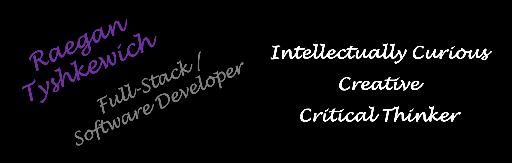

## Hello Everyone 👋

### I have a passion and intellectual curiosity for solving technical challenges. I am an accomplished mid-career professional with progressive experience working in, and collaborating with cross functional technical teams. I view each challenge as a learning opportunity and am confident, enthusiastic and determined to provide fit-for-purpose innovative solutions.  NOW LETS DO SOME CODING!

### Contact 

  

#### 

#### Frontend /Programming

<!---->
<!---->

#### Backend

#### Database

#### API

#### Package managers

##### Version control system

<!--
**RaeganTysh/RaeganTysh** is a ✨ _special_ ✨ repository because its `README.md` (this file) appears on your GitHub profile.

Here are some ideas to get you started:

- 🔭 I’m currently working on ...
- 🌱 I’m currently learning ...
- 👯 I’m looking to collaborate on ...
- 🤔 I’m looking for help with ...
- 💬 Ask me about ...
- 📫 How to reach me: ...
- 😄 Pronouns: ...
- ⚡ Fun fact: ...
-->
